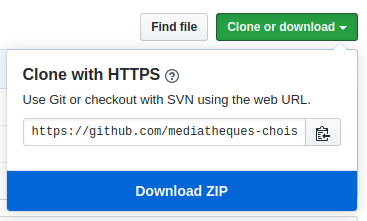

# [Ressources] Atelier Godot : Boule magique numéro 8

## Mode d'emploi

Pour télécharger les ressources de l'atelier il suffit de cliquer sur le bouton vert "Clone or Download", puis de sélectionner "Download ZIP".

## License
La typographie [CMRDD-Bold](https://gitlab.com/swrs/cmrdd) de Paul Bernhard est redistribuée grâce à sa licence SIL Open Font License v1.1 (OFL-1.1).
Les dessins et sons ont été créées par [Alexandre Lejeune](https://github.com/darkbeanbbq) et sont sous [Licence Creative Commons Attribution 4.0 International (CC BY 4.0)](https://creativecommons.org/licenses/by/4.0/deed.fr).
Ainsi toutes les ressources peuvent être librement utilisées, modifiées et redistribuées.

